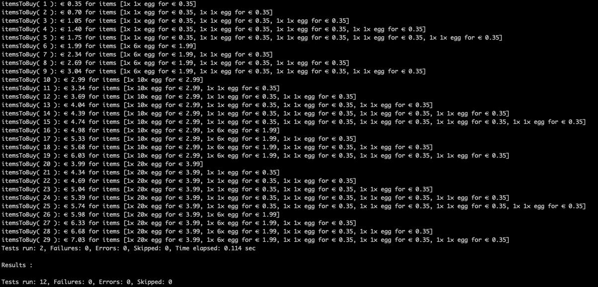

![Contributors][contributors-shield]
![Forks][forks-shield]
![Stargazers][stars-shield]
![Issues][issues-shield]

<div id="top"></div>
<br />
<div align="center">
  <a href="https://github.com/jeortizquan/groceries-knapsack-algorithm">
    
  </a>

<h3 align="center">Shopping List of Groceries</h3>

  <p align="center">
    Knapsack algorithm personalized
    <br />
    <a href="https://github.com/jeortizquan/groceries-knapsack-algorithm"><strong>Explore the docs »</strong></a>
    <br />
    <br />
    <a href="https://github.com/jeortizquan/groceries-knapsack-algorithm">View Demo</a>
    ·
    <a href="https://github.com/jeortizquan/groceries-knapsack-algorithm/issues">Report Bug</a>
    ·
    <a href="https://github.com/jeortizquan/groceries-knapsack-algorithm/issues">Request Feature</a>
  </p>
</div>

<!-- TABLE OF CONTENTS -->
<details>
  <summary>Table of Contents</summary>
  <ol>
    <li>
      <a href="#about-the-project">About The Project</a>
      <ul>
        <li><a href="#built-with">Built With</a></li>
      </ul>
    </li>
    <li>
      <a href="#getting-started">Getting Started</a>
      <ul>
        <li><a href="#prerequisites">Prerequisites</a></li>
        <li><a href="#installation">Installation</a></li>
      </ul>
    </li>
    <li><a href="#usage">Usage</a></li>
    <li><a href="#roadmap">Roadmap</a></li>
    <li><a href="#contributing">Contributing</a></li>
    <li><a href="#license">License</a></li>
    <li><a href="#contact">Contact</a></li>
    <li><a href="#acknowledgments">Acknowledgments</a></li>
  </ol>
</details>


<!-- ABOUT THE PROJECT -->
## About The Project



<p align="right">(<a href="#top">back to top</a>)</p>

### Built With

* [Java](https://openjdk.java.net)

<p align="right">(<a href="#top">back to top</a>)</p>

<!-- GETTING STARTED -->
## Getting Started

Instructions on setting up the project locally to get a local copy up and running follow these simple example steps.

### Prerequisites

* maven 3.5.2
* openjdk 17  

### Installation

1. Clone the repo
   ```sh
   git clone https://github.com/jeortizquan/groceries-knapsack-algorithm.git
   ```
2. Install Maven packages
   ```sh
   mvn install
   ```
   
3. Build app
   ```sh
   mvn package
   ```

<p align="right">(<a href="#top">back to top</a>)</p>

<!-- USAGE EXAMPLES -->
## Usage

   ```sh
   mvn test
   ```

<p align="right">(<a href="#top">back to top</a>)</p>

<!-- ROADMAP -->
## Roadmap

- [X] Optimizer Simple Packages
- [X] Optimizer Packages + Items

See the [open issues](https://github.com/jeortizquan/groceries-knapsack-algorithm/issues) for a full list of proposed features (and known issues).

<p align="right">(<a href="#top">back to top</a>)</p>


<!-- CONTRIBUTING -->
## Contributing

Contributions are what make the open source community such an amazing place to learn, inspire, and create. 
Any contributions you make are **greatly appreciated**.

If you have a suggestion that would make this better, please fork the repo and create a pull request. 
You can also simply open an issue with the tag "enhancement".
Don't forget to give the project a star! Thanks again!

1. Fork the Project
2. Create your Feature Branch (`git checkout -b feature/AmazingFeature`)
3. Commit your Changes (`git commit -m 'Add some AmazingFeature'`)
4. Push to the Branch (`git push origin feature/AmazingFeature`)
5. Open a Pull Request

<p align="right">(<a href="#top">back to top</a>)</p>


<!-- LICENSE -->
## License

private

<p align="right">(<a href="#top">back to top</a>)</p>

<!-- CONTACT -->
## Contact

Project Link: [https://github.com/jeortizquan/groceries-knapsack-algorithm](https://github.com/jeortizquan/groceries-knapsack-algorithm)

<p align="right">(<a href="#top">back to top</a>)</p>

<!-- ACKNOWLEDGMENTS -->
## Acknowledgments

* Blessed are the merciful, for they will be shown mercy.

<p align="right">(<a href="#top">back to top</a>)</p>

[contributors-shield]: https://img.shields.io/github/contributors/jeortizquan/groceries-knapsack-algorithm.svg?style=for-the-badge
[forks-shield]: https://img.shields.io/github/forks/jeortizquan/groceries-knapsack-algorithm.svg?style=for-the-badge
[forks-url]: https://github.com/jeortizquan/groceries-knapsack-algorithm/network/members
[stars-shield]: https://img.shields.io/github/stars/jeortizquan/groceries-knapsack-algorithm.svg?style=for-the-badge
[stars-url]: https://github.com/jeortizquan/groceries-knapsack-algorithm/stargazers
[issues-shield]: https://img.shields.io/github/issues/jeortizquan/groceries-knapsack-algorithm.svg?style=for-the-badge
[issues-url]: https://github.com/jeortizquan/groceries-knapsack-algorithm/issues